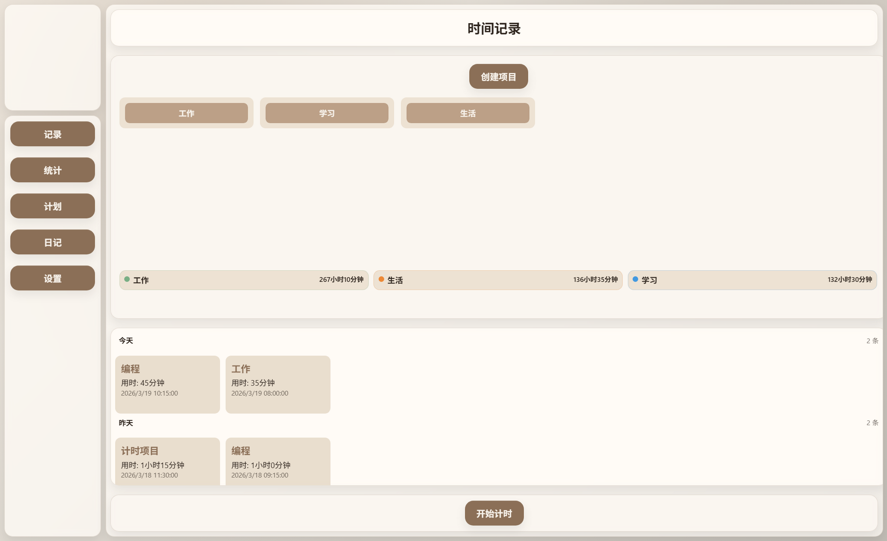
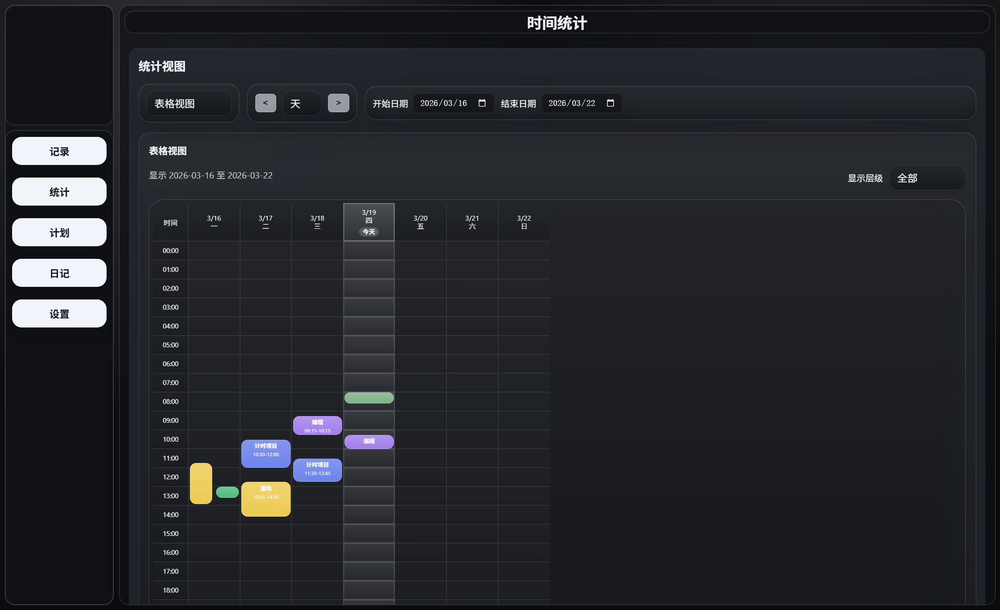
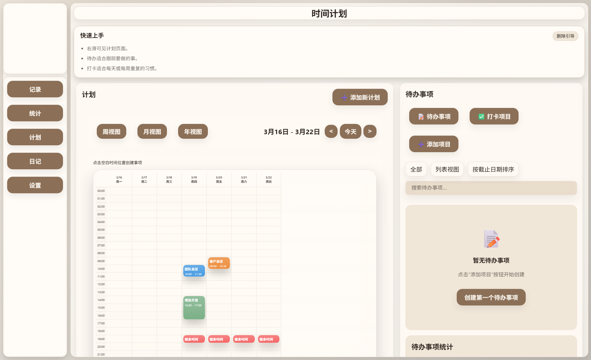
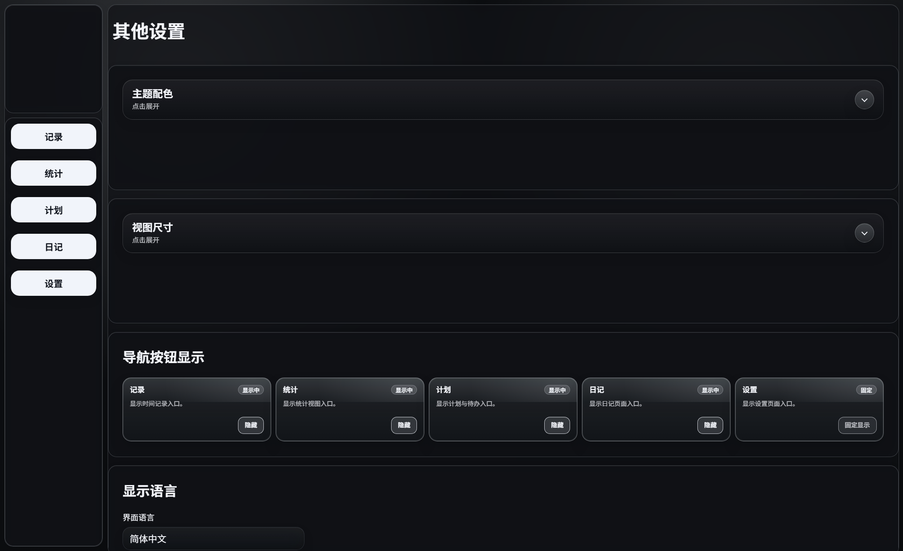

# Order

Order 是一个本地优先的时间管理应用，聚合了时间记录、统计、计划、待办、打卡、日记和桌面/移动小组件能力。

Order is a local-first time management app for time tracking, statistics, planning, todos, check-ins, diary workflows, and desktop/mobile widgets.

> English users: switch the interface language first in `Settings > Display Language > Interface Language > English` before using the app.
>
> 英文用户首次使用前，请先到 `设置 > 显示语言 > 界面语言 > English` 切换界面语言。

> Screenshots below use demo data only. No personal records are included.
>
> 下方截图均为演示数据，不包含任何个人记录。
>
> The screenshots use the `Champagne Sandstone` and `Obsidian Black` themes.
>
> 这些截图使用了 `香槟砂岩` 与 `曜石黑` 两套主题。

## Screenshots / 截图

<p align="center">
  
  
</p>

<p align="center">
  
  
</p>

- `记录 / Record`：查看项目层级、最近记录，并从这里开始计时
- `统计 / Stats`：按时间范围查看表格、图表和项目分层统计
- `计划 / Plan`：按周 / 月 / 年安排计划，并进入待办与打卡区域
- `设置 / Settings`：调整主题、视图尺寸、导航显示和语言

## Features / 功能概览

- 多级项目结构：支持一级、二级、三级项目，适合把工作、学习、生活继续拆分。
- 时间记录：快速开始计时，支持切换当前项目和下一个项目。
- 统计分析：提供表格视图、饼图、折线图和日历热图。
- 计划与待办：提供周 / 月 / 年计划视图、待办事项和打卡项目。
- 日记与分类：支持本地日记记录和分类管理。
- 本地优先：数据默认保存在本地 JSON 或平台本地存储中，支持导出、导入和自定义存储路径。
- 小组件：桌面端和 Android 端都保留了小组件入口。

- Multi-level project hierarchy for level 1, level 2, and level 3 projects.
- Fast time tracking with current-project and next-project workflow.
- Stats views for tables, pie charts, line charts, and calendar heatmaps.
- Planning, todos, and recurring check-ins in one workflow.
- Local diary entries with category management.
- Local-first storage with export, import, and custom storage-path support.
- Desktop and Android widget entry points.

## Quick Start / 快速使用

1. 如果你是英文用户，先进入 `设置 / Settings` 页面，把 `界面语言 / Interface Language` 切换到 `English`。
2. 先创建一级项目，再按需要继续创建二级、三级项目。
3. 在 `记录 / Record` 页面点击 `开始计时 / Start Timer`，选择当前项目并开始记录。
4. 记录完成后，到 `统计 / Stats` 页面查看最近 7 到 14 天的表格视图，或切换到图表和热图。
5. 到 `计划 / Plan` 页面安排周 / 月 / 年计划，并把待办事项和打卡项目放进去统一管理。
6. 到 `设置 / Settings` 页面导出数据、导入数据、调整视图尺寸，或修改存储位置。

## Interaction Tips / 交互说明

- 一级、二级项目支持双击展开或折叠。
- 记录列表中的单条记录可单击编辑。
- 只有最后一次记录的删除支持回滚时间，并且可以重复回滚。
- 其他记录如果要编辑名称或删除，请到 `统计 / Stats` 的表格视图中双击对应记录。
- 所有视图都可以在 `设置 / View Size` 中放大或缩小。

## Platforms And Data / 平台与数据

- 桌面端使用 Electron，当前主要面向 Windows，仓库中保留了 macOS 打包脚本。
- 移动端使用 React Native，仓库包含 Android 与 iOS 工程。
- 浏览器模式可用于部分页面调试，但完整存储路径管理和桌面小组件能力依赖 Electron 或原生壳层。
- 项目默认不依赖仓库自带云服务，数据通常保存在本地 JSON 文件或平台本地存储中。
- 你可以自行使用 Syncthing、共享文件夹或第三方云盘同步文件，但这些不属于本项目托管服务。

- Desktop uses Electron and is currently focused on Windows, with macOS packaging scripts kept in the repo.
- Mobile uses React Native, and the repository includes Android and iOS projects.
- Browser mode is useful for partial page debugging, but full storage-path management and desktop widgets depend on Electron or a native shell.
- The project does not ship with a hosted backend by default. Data usually stays in local JSON files or platform-local storage.
- You may sync files with Syncthing, shared folders, or third-party cloud drives, but those are outside the project itself.

## Development / 开发命令

建议使用 **Node.js 20.19.4 或更高版本**。

Recommended Node.js version: **20.19.4 or later**.

```bash
npm install
npm start
```

```bash
npm run dist:win
npm run mobile:install
npm run mobile:start
npm run mobile:android
npm run mobile:apk
```

如需重新生成 README 截图，可运行：

```bash
npm run docs:screenshots
```

这条命令会使用隔离的演示数据重新生成 `docs/readme-assets` 中的截图。

Windows / Android 内部分发免费签名流程见 [docs/internal-signing-guide.md](./docs/internal-signing-guide.md)。

## License / 许可

本项目以 [MIT License](./LICENSE) 发布。

This project is released under the [MIT License](./LICENSE).

## Disclaimer / 免责声明

本项目按“现状”提供。请自行负责数据备份、同步策略和第三方服务选择。详见 [DISCLAIMER.md](./DISCLAIMER.md)。

This project is provided "as is". You are responsible for your own backups, sync strategy, and third-party services. See [DISCLAIMER.md](./DISCLAIMER.md).

## Third-Party Notices / 第三方许可说明

仓库中 vendored 的前端依赖说明见 [THIRD_PARTY_NOTICES.md](./THIRD_PARTY_NOTICES.md)。

Notices for vendored frontend dependencies are listed in [THIRD_PARTY_NOTICES.md](./THIRD_PARTY_NOTICES.md).
